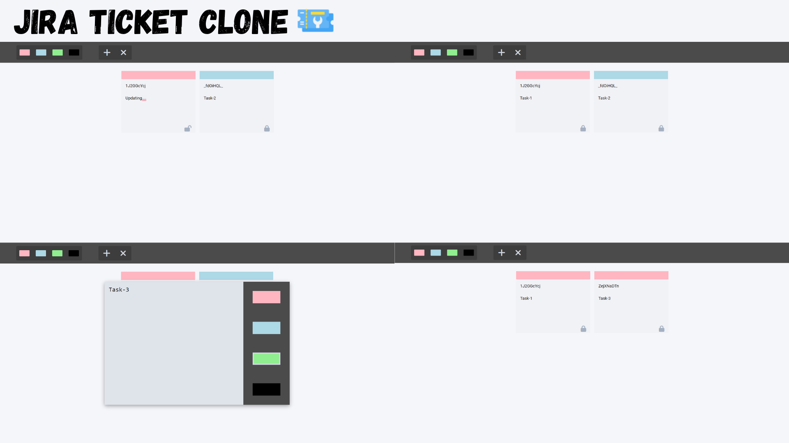

# Jira Ticket Clone

## **Description**

This project is a clone of the Jira ticketing system, designed to help manage tasks and priorities efficiently. It allows users to create, edit, and delete tickets, each with a specific priority color. The application also supports local storage to persist data across sessions.



## **Features**

-   **Create Tickets:** Add new tickets with a task description and priority color.
-   **Edit Tickets:** Modify the task description and change the priority color.
-   **Delete Tickets:** Remove tickets from the list.
-   **Filter Tickets:** Filter tickets based on their priority color.
-   **Local Storage:** Persist tickets data across browser sessions.

## **Technologies Used**

-   **HTML:** Structure of the web application.
-   **CSS:** Styling the application, including responsive design.
-   **JavaScript:** Functionality and interactivity of the application.
-   **Font Awesome:** Icons used in the application.

## **Project Structure**

-   **index.html**: Main HTML file.
-   **style.css**: Styles for the application.
-   **script.js:** file containing the main logic.

## **Installation**

1. Clone the repository:

```bash
https://github.com/lovishduggal/JiraTicketClone.git
```

2. Navigate to the project directory::

```bash
    cd jira-ticket-clone
```

## How to Use

1. Open the Application:
    - Open `index.html` in your web browser.
2. **Add a Ticket**:
    - Click the "Add" button to open the modal.
    - Enter the task description.
    - Select a priority color.
    - Press the "Shift" key to create the ticket.
3. **Edit a Ticket**:
    - Click the lock icon on the ticket to unlock it.
    - Edit the task description.
    - Click the lock icon again to save the changes.
4. **Delete a Ticket**:
    - Click the "Remove" button to enable delete mode.
    - Click on the ticket you want to delete.
5. **Filter Tickets**:
    - Click on a color in the toolbox to filter tickets by that color.
    - Double-click on a color in the toolbox to display all tickets.

## **Contributing**

Contributions are welcome! Please open an issue or submit a pull request for any changes.

## **Contact**

For any inquiries, please contact lovishduggal11@gmail.com.
